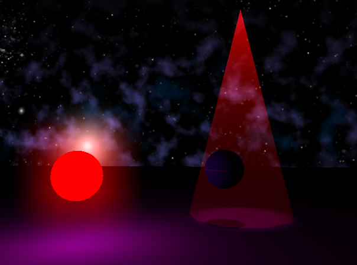
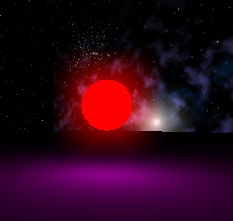
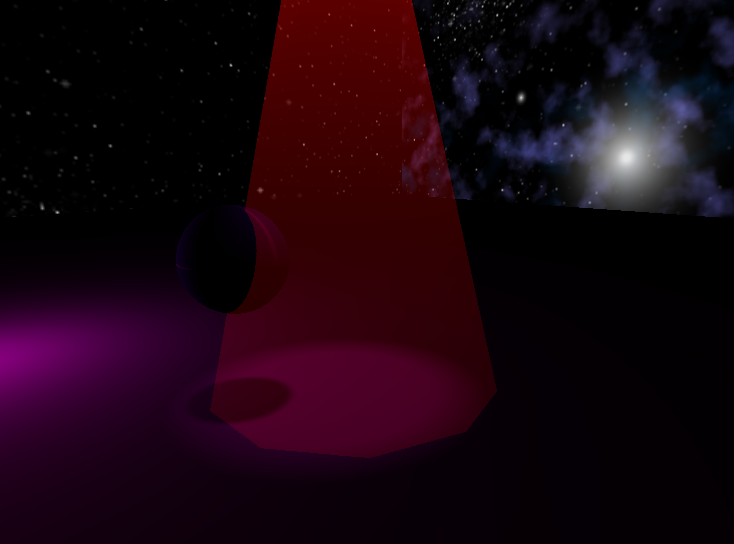

We tried to accomplish 2 effects. Bloom and volumetric spotlights.

We have several freambuffers to generate our final image.
* M framebuffers for each light to save depth for shadow mapping.
* N framebuffers for each spotlights to compute light volume (in this case it's a cone).
* 1 buffer to save components for referred rendering (gbuffer).
* 1 utility buffer to save the generated phong color, blured bloom and others..
* The main buffer with the final color mix.

## Bloom

At the beginning we coded the classic bloom implementation using bright colours but we found that it can blur some scene parts that we don't want. So to take more control over this effect we added a flag in the material attributes. If the flag is true it will perform the blur effect using the diffuse color and ignoring the brightness.
Also it gives you the freedom to not depends on other shader to generate the final effects.
In our example we created a red ball with the bloom effect activated, then to make it look like it emits light we set a high ambient value and a light entity.

## Volumetric lights

We tried to accomplish a volumetric spotlight. We create a framebuffer for every spotlight to draw their light cone. At the end we mix it with the final image.
We could not accomplish the correct light intersection with object to create the cuts in the light volume.

